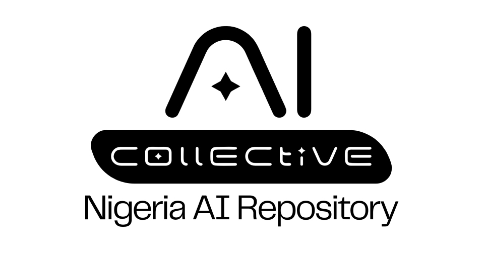

 

# AI Collective Repository
A catalogue of the full spectrum of AI advancement in the country — from documented innovation use cases and data collection initiatives to emerging tools and technologies supporting AI implementation. It also features notable events, news, and key milestones that highlight Nigeria's growing footprint in the global AI ecosystem.
  **Topic tags:** #AI, #Nigeria, #National Strategy, #PolicyGovernance, #Infrastructure, #Datasets, #Benchmarks, #Startups, #Health, #Education, #Agriculture, #Finance, #Media, #Community, #Events, #Open Source

## Table of Contents

- [Nigeria AI Collective Overview Page](#nigeria-ai-collective-overview-page)
  - [Mission Statement](#mission-statement)
  - [Scope](#scope)
  - [Access Guide](#access-guide)
    - [Who is this for?](#who-is-this-for)
    - [How to use this repository](#how-to-use-this-repository)
- [Nigeria AI Collective Executive Leadership Learning Series](#nigeria-ai-collective-learning-series)
- [Nigeria AI Portfolio and Government Involvement](#nigeria-ai-portfolio-and-government-involvement)
  - [Governmental bodies Involvement](#governmental-bodies-involvement)
  - [Activities of the Federal Minister of Communications, Innovation and Digital Economy, Dr. Bosun Tijani](#activites-of-the-federal-minister-of-communications-innovation-and-digital-economy-dr-bosun-tijani)
  - [AI Policy and Governance](#ai-policy-and-governance)
  - [Public & NGO-Led Initiatives](#public--ngo-led-initiatives)
  - [Global Collaboration Partnerships](#global-collaboration-partnerships)
  - [Tools & Platforms](#tools--platforms)
  - [AI Infrastructure](#ai-infrastructure)
  - [Published Papers by Nigerian Researchers](#published-papers-by-nigerian-researchers)
  - [Directory of AI Startups](#directory-of-ai-startups)
  - [AI Learning Content Developed By Nigerians](#ai-learning-content-developed-by-nigerians)
- [Sectorial Applications](#sectorial-applications)
  - [Sectoral AI Adoptions](#sectoral-ai-adoptions)
  - [Hackathons](#hackathons)
- [Ecosystem Activities and Events](#ecosystem-activities-and-events)
  - [Events](#events)
- [Data & Open-Source Assets](#data--open-source-assets)
  - [Datasets](#datasets)
  - [Benchmarks](#benchmarks)
  - [API Libraries & Frameworks](#api-libraries--frameworks)
- [Innovation](#innovation)
  - [Innovation Highlights](#innovation-highlights)
- [Awards](#awards)
  - [Major National Achievement and Recognitions](#major-national-achievement-and-recognitions)\
  - [Local Awards](#local-awards)
- [Accepted AI Papers in Conferences](#accepted-ai-papers-in-conferences)
  - [NeurIPS](#neurips)
  - [ICLR](#iclr)
  - [ACL](#acl)
  - [Deep Learning Indaba](#deep-learning-indaba)
  - [EACL 2026 / AfricaNLP 2026](#eacl-2026--africanlp-2026)
- [Community Platforms](community-platforms)
  - [Visit our Social Media Pages](#visit-our-social-media-pages)
- [Contributors](#contributors)

---

## Nigeria AI Collective Overview Page

* ### [Mission Statement]() 
The AI Collective repository exists to democratize access to artificial intelligence by fostering a collaborative, transparent, and inclusive community. Our mission is to accelerate AI innovation for the collective good, ensuring that AI research, tools, and practices are openly shared, ethically developed, and accessible to everyone regardless of background or affiliation. We believe in the power of collective intelligence and open-source collaboration to shape a future where AI benefits all of humanity, not just a select few.

* ### [Scope]() 
The AI Collective repository exists to democratize access to artificial intelligence by fostering a collaborative, transparent, and inclusive community. Our mission is to accelerate AI innovation for the collective good, ensuring that AI research, tools, and practices are openly shared, ethically developed, and accessible to everyone regardless of background or affiliation. We believe in the power of collective intelligence and open-source collaboration to shape a future where AI benefits all of humanity, not just a select few.

* ### [Access Guide]()

**Who is this for?**

Researchers and academics seeking the latest AI developments or wishing to contribute new findings.
Developers and engineers looking for open-source AI tools, models, and codebases.
Entrepreneurs and startups exploring AI-driven solutions and business models.
Policymakers, advocates, and ethicists interested in the societal impacts and governance of AI.
Students and enthusiasts eager to learn, experiment, or join a collaborative AI community.

### How to use this repository:

**Explore:** Browse curated lists of AI tools, research, and resources organized by topic and type.

**Contribute:** Fork the repository, add your resources, research, or tools, and submit a pull request. Review the [Contribution Guidelines](https://github.com/aicollectiveng/Nigeria-AI-Repository/blob/main/Contributors%20Guide.md) for best practices and requirements.

**Collaborate:** Join discussions, propose new initiatives, or help review and improve existing content. The community thrives on active participation and diverse perspectives.

**Learn:** Access tutorials, guides, and recommended learning paths for all experience levels, from beginners to advanced practitioners.

**Stay Updated:** Watch the repository or join our community channels to receive updates on new contributions, events, and collaborative projects.

By engaging with the AI Collective, you join a global effort to make artificial intelligence more open, ethical, and impactful for everyone.

## Nigeria AI Collective Learning Series

* **AI Collective Learning Series** – Welcome to our exclusive and immersive 13-week learning series, meticulously designed to demystify the world of artificial intelligence and equip you with the knowledge and strategies to drive innovation, efficiency, and growth.
  - Episode 1: [Understanding AI](https://www.youtube.com/watch?v=DgcW27952QQ&list=PLZLNl5L70BlFvUXnrEOkLcyeRjrxSrtgt&index=13)  
  - Episode 2: [AI for Emerging Markets](https://www.youtube.com/watch?v=QJhV7QG6zIU&list=PLZLNl5L70BlFvUXnrEOkLcyeRjrxSrtgt&index=12)
  - Episode 3: [The 5 Operational Pillars of the Nigerian AI Strategy](https://www.youtube.com/watch?v=mm6InwnaVGg&list=PLZLNl5L70BlFvUXnrEOkLcyeRjrxSrtgt&index=11)
  - Episode 4: [AI Catalysts for Innovation and Breakthrough Solutions](https://www.youtube.com/watch?v=R3P76tCH9Dc&list=PLZLNl5L70BlFvUXnrEOkLcyeRjrxSrtgt&index=10)
  - Episode 5: [AI for Business Efficiency and Cost Reduction](https://www.youtube.com/watch?v=QsvfS-45c14&list=PLZLNl5L70BlFvUXnrEOkLcyeRjrxSrtgt&index=6)
  - Episode 6: [AI as a Driver of Business Growth and New Revenue](https://www.youtube.com/watch?v=bWZ4hx-p1tg&list=PLZLNl5L70BlFvUXnrEOkLcyeRjrxSrtgt&index=4)
  - Episode 7: [AI, Future of Work & Workforce Transformation](https://www.youtube.com/watch?v=aUAdKJhicJI&list=PLZLNl5L70BlFvUXnrEOkLcyeRjrxSrtgt&index=3)
  - Episode 8: [Customer-Centric AI](https://www.youtube.com/watch?v=3UJyKniOLao&list=PLZLNl5L70BlFvUXnrEOkLcyeRjrxSrtgt&index=2)
  - Episode 9: [AI in Sustainability – Driving ESG Goals Through Technology](https://www.youtube.com/watch?v=z2olfwo5l90&list=PLZLNl5L70BlFvUXnrEOkLcyeRjrxSrtgt&index=1)
  - Episode 10: [Risk Management – AI-Powered Predictive and Preventive Strategies](https://www.youtube.com/watch?v=c2BFNizBs0I&list=PLZLNl5L70BlFvUXnrEOkLcyeRjrxSrtgt&index=9)
  - Episode 11: [Ethical AI – Balancing Profit and Principles](https://www.youtube.com/watch?v=kaGVY_N93YY&list=PLZLNl5L70BlFvUXnrEOkLcyeRjrxSrtgt&index=8)
  - Episode 12: [AI Governance – Managing Risks & Compliance in AI Adoption](https://www.youtube.com/watch?v=iHgdKq4vdrQ&list=PLZLNl5L70BlFvUXnrEOkLcyeRjrxSrtgt&index=7)
  - Episode 13: [AI for Social Good and Shared Prosperity](https://www.youtube.com/watch?v=EnRh69bgG9I&list=PLZLNl5L70BlFvUXnrEOkLcyeRjrxSrtgt&index=5)
  
Join Our Youtube Community by Subscribing to our Channel Here: [YouTube](https://www.youtube.com/@aicollectiveng/playlists)

## Nigeria AI Portfolio and Government Involvement

* ### Governmental bodies Involvement 
  - [National Information Techonology Development Agency (NITDA)](https://nitda.gov.ng) 
  - [The National Centre for Artifical Intelligence and Robotics (NCAIR)](https://ncair.nitda.gov.ng/)
  - [Nigeria Data Protection Commission (NDPC)](https://ndpc.gov.ng/)
  - [Nigerian Communications Commission (NCC)](https://www.ncc.gov.ng/)
  - [Federal Ministry of Communications, Innovation & Digital Economy](https://www.fmcide.gov.ng/)
 

* ### **AI Policy and Governance** 
  - [Nigeria National AI Strategy Publication](https://ncair.nitda.gov.ng/wp-content/uploads/2025/09/National-Artificial-Intelligence-Strategy-19092025.pdf)
  - [AI-driven anti-money-laundering and credit-risk systems in Nigerian banks](https://www.cbn.gov.ng/Out/2025/CCD/Exposure%20Draft%20on%20Baseline%20Standards%20for%20Automated%20AML%20Solutions.pdf)
  - [Service-Wise GPT for public-service process automation](https://ohcsf.gov.ng/2025/03/18/nigeria-unveils-ai-driven-public-service-transformation-at-global-government-summit-2025/)
  - [UNESCO RAM context-specific policy recommendations that can guide sustainable AI adoption in the country.](https://www.linkedin.com/posts/dsnai_datasciencenigeria-aireadiness-responsibleai-activity-7330556314839928832-9kGD/?utm_source=share&utm_medium=member_desktop&rcm=ACoAABiM5boBU9nVr4TqW0ygTK5T5Qa8GhSm8Oo)
  - [Activites of the Federal Minister of Communications, Innovation and Digital Economy, Dr. Bosun Tijani](https://youtu.be/aNnOeT2Rg30)
  - [UNESCO Nigeria AI Readiness Assessment (RAM) Report](https://unesdoc.unesco.org/ark:/48223/pf0000398538) - Launched in Abuja on 22 June 2026 by UNESCO, the EU and the Federal Ministry of Communications, Innovation & Digital Economy; the first comprehensive assessment of Nigeria's readiness to develop, deploy and regulate AI across infrastructure, data, policy, research and institutional capacity. ([launch coverage](https://nannews.ng/unesco-presents-ai-report-to-strengthen-ethical-use/))
  - [National Digital Economy and E-Governance Bill](https://iafrica.com/nigeria-moves-to-approve-landmark-law-regulating-artificial-intelligence/) - A risk-based AI regulatory framework naming NITDA as the central "super-regulator," with mandatory audits and licensing for high-risk systems in finance, public administration and surveillance; expected to make Nigeria one of the first African countries with binding AI legislation.
  - [National AI Strategy at 2 — Impact Story](https://bit.ly/NAIS-2_Report) - Two-year ecosystem review documenting 700,000+ Nigerians reached through AI skills, $1.85bn in AI-related investment commitments, 120+ active AI startups (3.4x growth), and the launch of N-ATLAS, Africa's first government-backed multimodal, multilingual LLM.
  - [REST-AI Governance Framework](https://leadership.ng/africa-unveils-ai-governance-framework-asserts-digital-sovereignty-2/) - A continental AI governance framework unveiled at Tech Symposium Africa 2026 in Abuja on 30 April 2026; built on five pillars and 143 action points and designed for African realities rather than adapted from abroad. The working draft was released for public consultation by Dr Nasir Yammama, Senior Special Assistant to the President on Innovation.
  - [Nigeria Digital Sovereignty and Fair Data Compensation Bill 2025](https://iapp.org/news/a/nigeria-moves-toward-comprehensive-ai-regulation) - A proposed bill targeting the extraction and monetisation of Nigerian data by foreign companies; includes data-localisation requirements, a "local content" rule that a share of AI research on Nigerian data be conducted in-country, and the principle that Nigerians be compensated when their data trains AI models.
  - [National Artificial Intelligence Commission (Establishment) Bill](https://iapp.org/news/a/nigeria-moves-toward-comprehensive-ai-regulation) - A separate bill proposing a dedicated National AI Commission to oversee AI development in Nigeria, part of the wider 2025–2026 legislative push around AI governance.

* ### **Public & NGO-Led Initiatives** 
  - [Nigeria AI Scaling Hub](https://fmcide.gov.ng/nigeria-launches-ai-scaling-hub-in-collaboration-with-gates-foundation-to-accelerate-impact-in-health-education-and-agriculture/) - A multi-stakeholder initiative by the Federal Ministry of Communications, Innovation & Digital Economy and the Gates Foundation. It accelerates scaling of impactful AI solutions in health, education, and agriculture, supporting innovators with resources and mentorship.
  - [National AI Strategy Unveiling and Launch](https://nairametrics.com/2025/04/16/nigeria-launches-national-ai-strategy-to-drive-ai-development-and-productivity/) - Nigeria officially launched its National Artificial Intelligence Strategy (NAIS) in April 2025, positioning AI as a driver of economic growth, innovation, and productivity across key sectors. The unveiling took place in Lagos, led by Dr. Bosun Tijani, Minister of Communications, Innovation, and Digital Economy.
  - [National Centre for Artificial Intelligence and Robotics (NCAIR)](https://ncair.nitda.gov.ng/) -  Nigeria’s flagship research and development center focusing on AI, robotics, and fourth industrial revolution technologies. Supports innovation through research, infrastructure, and skills development.
  - [UNILAG NITHUB](https://nithub.unilag.edu.ng/) - A NITDA-funded initiative serving as a premier technology innovation hub. NitHub provides an enabling environment for developers, startups, and students to collaborate, receive mentorship, and build digital skills.
  - [AI In Nigeria (AIN) Platform](https://aiinnigeria.com/about-us/) - A broad-based movement aiming to establish Nigeria as a global AI hub, facilitating innovation and partnerships across government and civil society.
  - [Service-Wise GPT – Public Service Transformation](https://www.ohcsf.gov.ng/post-nigeria_unveils_ai_driven_public_service_transformation__at_global_government_summit_2025) - A government-led initiative providing AI-powered tools (like Service-Wise GPT) to revolutionize public service delivery and citizen engagement.
  - [Collaborative Centre for AI, Nigeria (CCAI)](https://www.cosmopolitan.edu.ng/collaborative-centre-for-ai) - A multidisciplinary hub for collaborative research and development across academic and public sectors, advancing AI technologies and governance.
  - [Nigeria AI Accelerator Programme (with Meta)](https://techpoint.africa/news/nigeria-meta-ai-accelerator/) -  A government partnership with Meta (Facebook) to support startups building AI-driven solutions that tackle Nigeria’s social and economic challenges. Provides mentorship, technical resources, and sectoral support, managed by the National Information Technology Development Agency (NITDA).
  - [Artificial Intelligence Industry Collective (AI Collective)](https://ncair.nitda.gov.ng/aicollective/) - A coalition of civil society, academic, private, and governmental players advancing responsible and inclusive AI development and adoption, emphasizing ethical and social impact.
  - [Nigeria National AI Trust](https://techafricanews.com/2025/02/05/nigeria-advances-ai-and-connectivity-with-two-major-government-initiatives/) - The world's first government-backed trust dedicated to AI, designed to mobilize resources, guide development, and ensure ethical oversight of AI’s national impact.
  - [Digital Inclusion and Universal Communication Access Project](https://techafricanews.com/2025/02/05/nigeria-advances-ai-and-connectivity-with-two-major-government-initiatives/) - Federal initiative expanding broadband and digital infrastructure to unserved and underserved areas, laying essential groundwork for equitable AI access and innovation.
  - [Data Science Nigeria's Arewa Ladies for Tech](https://datasciencenigeria.org/arewa/) - An initiative empowering young women in Northern Nigeria with digital skills, mentorship, and opportunities in technology and data science.
  - [Nigeria AI Scaling Hub (NAISH) — Official Launch & SAID Challenge](https://punchng.com/fg-unveils-ai-scaling-hub-7-5m-fund-for-public-sector-innovation/) - Formally inaugurated on 26 June 2026 with a $7.5m, three-year Gates Foundation commitment. Hosted by Lagos Business School, Pan-Atlantic University, it provides local AI compute and pairs mature Nigerian AI solutions with government agencies through the Scaling AI for Development (SAID) Challenge (apply: naish.lbs.edu.ng).
  - [Nigeria AI Collective — Open GPU Compute Access Program](https://bit.ly/AIComputeSupport) - The Collective's own program offering researchers, startups and AI communities access to GPU compute, model-training support, fine-tuning assistance and mentorship, with the opportunity to showcase work at the AI Summit in October 2026.
  - [CJID AI Advocacy Project & AI Community of Practice](https://thecjid.org/call-for-applications-ai-for-civil-society-workshop/) - A Centre for Journalism Innovation and Development (CJID) initiative under the Collective's CSOs Community of Practice, advancing public understanding of AI and inclusion of women, youth, rural communities and persons with disabilities in AI conversations.
  - [FactCheckAfrica Digital Democracy Suite](https://iafrica.com/) - Launched 7 May 2026: civic AI tools comprising KedereAI (a plain-language government accountability platform), GovQuest (scenario-based civic games) and The Power Deck (offline civic flashcards), built ahead of Nigeria's 2027 elections with support from the Ford and MacArthur Foundations.
  - [AI University Innovation Pod (UniPod) at UNILAG](https://www.undp.org/nigeria/press-releases/nigeria-flags-ai-unipod-university-lagos-nationwide-unipod-rollout-begins) - Flagged off 7 April 2026 by VP Kashim Shettima; a Federal Government–UNDP–TETFund partnership turning universities into AI production and enterprise hubs, with eight universities in the first cohort and plans to scale to 50+ nationwide.
  - [Renewed Hope–NITDA Innovation Hub at OAU](https://oauife.edu.ng/) - Commissioned 8 June 2026 at Obafemi Awolowo University, Ile-Ife; houses labs for AI, robotics, additive manufacturing and IoT, joining University of Nigeria Nsukka and Ahmadu Bello University as federally backed university innovation hubs.
   
 
* ###  Global Collaboration Partnerships
  - [Cassava AI Exchange connects African telcos to OpenAI, Google, and Anthropic](https://www.cassava.ai/2025/11/12/africa-first-ai-multi-model-exchange/)
  - [Nigeria AI Scaling Hub (FMCIDE × Gates Foundation)](https://fmcide.gov.ng/nigeria-launches-ai-scaling-hub-in-collaboration-with-gates-foundation-to-accelerate-impact-in-health-education-and-agriculture/)
  - [EU–Nigeria Science, Technology, and Innovation Agreement](https://guardian.ng/news/eu-nigeria-deepen-ai-cooperation-through-research-partnerships/)
  - [Microsoft $1M AI Skilling Initiative for One Million Nigerians](https://punchng.com/microsoft-plans-ai-training-for-one-million-nigerians/)
  - [Meta × Nigeria National AI Accelerator Program](https://newskobo.com/2025/06/11/nigeria-partners-with-meta-to-launch-national-ai-accelerator/)
  - [Africa’s First Neutral Multi-Tenant AI Factory (BCN × Zadara × Touchnet)](https://bcnnigeria.net/index.php/africa-s-first-neutral-ai-factory-debuts-in-nigeria-through-bcn-zadara-collaboration/)
  - [Strategic Stakeholder Learning Immersion in Singapore](https://www.linkedin.com/posts/dsnai_iclr2025-datasciencenigeria-aifornigeria-activity-7326588955150196736-wDwM/)
  - [Meta partners with RAIN to empower Nigerian AI developers](https://www.linkedin.com/posts/robotics-artificial-intelligence-nigeria-rain_agenticaicertification-metaaideveloperacademy-activity-7392679127029534720-Wyrn)
  - [Nigeria National AI Trust — Vision Launched in London](https://guardian.ng/news/bosun-tijani-launches-nigerias-ai-trust-vision-in-london/) - Unveiled 19 June 2026 at Warwick Business School, London, and already approved by the Federal Executive Council; described as the first institution of its kind in the world, designed as a body of trustees to steer ethical AI investment beyond political cycles. Organised with Co-Creation Hub and the MacArthur Foundation.
  - [Anthropic × Gates Foundation — $200m AI Commitment](https://www.anthropic.com/news) - Announced 14 May 2026: grant funding, Claude usage credits and technical support for health, education and agriculture; African-language and smallholder-agriculture datasets built under the programme will be released as public goods for governments, researchers and developers.
  - [Bluechip Technologies Joins Anthropic's Claude Partner Network & Acquires YarnGPT](https://nairametrics.com/2026/06/12/bluechip-technologies-acquires-yarngpt-nigerian-text-to-speech-ai-built-for-local-languages/) - In June 2026 Bluechip joined Anthropic's vetted Claude Partner Network and acquired YarnGPT, the Nigerian text-to-speech startup (Yoruba, Igbo, Hausa, Nigerian-accented English) — a rare case of a hackathon project maturing into an acquisition.
  - [NITDA × Wigwe University AI Partnership](https://techafricanews.com/) - A strategic collaboration on locally driven AI covering research, agriculture (livestock, land-use and food systems), healthcare diagnostics, digital literacy and curriculum development.
  - [InnoPower Africa × Luma Learn AI — One Million Learners](https://innopower.africa/) - A 10 April 2026 partnership using a train-the-trainer model to expand AI tools and education to one million learners, students, teachers, families and MSMEs across the ECOWAS sub-region.
  - [Google.org — $2.1m (₦3bn) for Nigeria's AI Future](https://blog.google/intl/en-africa/company-news/outreach-and-initiatives/partnering-for-nigerias-ai-powered-future/) - Announced late 2025 in support of the National AI Strategy, channelled through five partners: FATE Foundation with AIMS (embedding advanced AI curricula into universities), the African Technology Forum (an AI innovation challenge), and JA Africa and the CyberSafe Foundation (digital safety and public-institution cybersecurity).
  
    
* ### **Tools & Platforms** 
  - [AfroSLM](https://afroslm.equalyz.ai/) - Developed by EqualyzAI, AfroSLM is a small language model designed for African languages, with a financial focus for Yoruba and also supporting general reasoning in Nigerian indigenous languages. It enables AI-powered translation and language understanding, helping to digitize and preserve local languages.
  - [N-ATLaS-LLM (African Multilingual LLM)](https://huggingface.co/NCAIR1/N-ATLaS) - A fine-tuned multilingual language model based on Llama-3 8B, supporting African languages including Hausa, Igbo, Yoruba, and English.
  - [AfriQueLLM – Open African Large Language Models](https://huggingface.co/collections/McGill-NLP/afriquellm) - A suite of open large language models adapted to 20 African languages through continued pre-training on 26B tokens.
  - [SabiYarn-125M – Nigerian Multilingual Language Model](https://aclanthology.org/2025.africanlp-1.14/) - A multilingual Nigerian language model supporting English, Yoruba, Hausa, Igbo, Pidgin, and more. 
  - [YARNGPT](https://yarngpt.co/) - An advanced text-to-speech AI platform for Nigerian languages, YarnGPT allows users to convert written text to speech in Yoruba, Igbo, Hausa, and English—offering both male and female authentic Nigerian voices, useful for education, accessibility, content creation, and business localization.
  - [InkubaLM](https://lelapa.ai/inkubalm-a-small-language-model-for-low-resource-african-languages/) - InkubaLM is a small language model targeted at low-resource African languages, aiming to provide NLP resources for underrepresented languages in Nigeria and Africa.
  - [African Languages Lab](https://www.africanlanguageslab.com/) - This initiative provides community-driven resources, research, and collaboration on African language technology, supporting linguistic diversity across the continent.
  - [CDIAL (Centre for Digitization of Indigenous African Languages)](https://indigenius.ai/) - CDIAL is focused on digitizing and preserving African indigenous languages, supporting research, data collection, and the development of language technologies.
  - [OBTranslate](https://www.obtranslate.org/) - Founded by Emmanuel Gabriel, OBTranslate is a deep learning AI platform capable of translating over 2,000 African languages, aiming to break communication barriers across Africa and enable digital trade, services, and inclusion. Its neural network processes billions of translation tasks for diverse applications.
  - [Igbo API](https://igboapi.com/) - The first open-source, multi-purpose API for the Igbo language, providing features like automatic speech recognition, machine translation, and an Igbo dictionary via REST API. Built with community data, it provides essential tools for developers working on Igbo/Nigerian language apps.
  - [LangEasy](https://www.awarri.com/langeasy) - A data collection platform by Awarri that enables users to record and translate sentences into Nigerian languages (Yoruba, Hausa, Igbo, Pidgin, Ibibio), powering AI language models with community-contributed data.
  - [Nkenne](https://www.nkenne.com/) - A learning app offering lessons and translation features for Nigerian languages such as Igbo, Yoruba, Hausa, Nigerian Pidgin, and more, with mobile-first experiences for language learning and localization.
  - [Wazobia Translator](https://wazobia-translator.soft112.com/#:~:text=Wazobia%20Translator%20is%20a%20simple,%2C%20Igbo%20to%20Hausa%2C%20etc.) - An open-source chatbot and translator available on GitHub, Wazobia can translate between English and Nigeria’s three top languages: Hausa, Igbo, and Yoruba. Designed as a tool for developers and language learners.
  - [Nigeria Learning Passport](https://nlp.education.gov.ng/) - A government and UNICEF initiative, it is an e-learning and language platform supporting core Nigerian languages. It provides online and offline language lessons and digital education resources, aiming for inclusivity and accessibility for all children.
  
* ### **AI Infrastructure**
  - [EqualyzAI GPU4Good provides on-demand access to high-performance compute for projects that advance inclusive, ethical, and socially beneficial AI.](https://equalyz.ai/gpu4good/)
  - [Schneider Electric Announces New AI Infrastructure Framework to Support Nigeria’s Growing Digital Economy](https://techpoint.africa/brandpress/schneider-electric-announces-new-ai-infrastructure-framework-to-support-nigerias-growing-digital-economy/)
  - [Data Centers started in 2025](https://newsroom.equinix.com/2025-11-10-Equinix-Announces-Plans-for-New-22-Million-Data-Center-in-Lagos,-Nigeria)  
  - [Airtel AI-powered Data Centre set to go live in 2026](https://techcabal.com/2025/08/06/airtel-bets-on-ai-with-120-million-data-centre-set-to-go-live-in-2026/)
  - [Kasi Cloud LOS1 — West Africa's First Hyperscale AI-Ready Data Centre](https://techafricanews.com/2026/05/28/kasi-cloud-datacenters-flags-off-west-africas-first-ai-ready-hyperscale-data-centre-in-lagos/) - Commissioned May 2026 in Lekki, Lagos; NSIA-backed, carrier-neutral, purpose-built for AI and designed to scale to ~100MW, offering a sovereign alternative to the ~$850m Nigeria spends annually on foreign cloud services.
  - [MTN Distributed AI Compute Grid & New Nigeria AI Data Centre](https://iafrica.com/mtn-plans-to-turn-its-african-tower-network-into-a-distributed-ai-compute-grid/) - MTN plans to fit open GPU hardware at base-station towers for edge AI inference and confirmed two new AI-enabled data centres, one in Nigeria and one in South Africa, as part of a "sovereign AI" infrastructure push.
  - [NAISH Local Compute — 8× NVIDIA H200 GPU Nodes](https://businessday.ng/news/article/fg-launches-ai-scaling-hub-unveils-7-5m-challenge-to-drive-ai-adoption-across-mdas/) - As part of the Nigeria AI Scaling Hub, eight NVIDIA H200 GPU compute nodes will be hosted at Galaxy Backbone's Tier III data centre in Abuja, with disaster-recovery support at its Tier IV facility in Kano.

* ### **Published Papers by Nigerian Researchers** 
  - [AI in Nigeria – Opportunities, challenges and strategic pathways](https://www.lbs.edu.ng/wp-content/uploads/2025/05/ai-in-nigeria-whitepaper.pdf)
  - [AI Landscape Report](https://ainowinstitute.org/publications/research/ai-now-2025-landscape-report)
  - [How Effective Are AI Models in Translating English Scientific Texts to Nigerian Pidgin: A Low-resource Language?](https://openreview.net/pdf?id=hDzVxEUN5C)  
  - [Geo-Semantics Analysis of Environmental Disasters in Nigeria](https://www.climatechange.ai/papers/iclr2025/53)
  - [AI in Yoruba STEM Education for Early Childhood Learning: An Evaluation on Translation Quality and Context](https://openreview.net/forum?id=scSLeA8DJr&referrer=%5Bthe%20profile%20of%20Ife%20Adebara%5D(%2Fprofile%3Fid%3D~Ife_Adebara1))
  - [Untapping African Music with AI: Investigating Music Source Separation Models for Low-Resource African Languages](https://openreview.net/attachment?id=q92ruhXB5F&name=pdf)
  - [Evaluating Speech To Text For Children With Speech Impairment](https://openreview.net/forum?id=orUUGhNU1x&referrer=%5Bthe%20profile%20of%20Ife%20Adebara%5D(%2Fprofile%3Fid%3D~Ife_Adebara1))
  - [Bridging The Language Gap: Evaluating Machine Translation For Animal Health In Lowresource Settings](https://openreview.net/pdf?id=6BCO7bqnjO)
  - [Neural Machine Translators (NMTs) as Efficient Forward and Backward Arabic Transliterators](https://openreview.net/pdf?id=Lu9KcdJhIi)
  - [Leveraging Geo-Nlp For Enhanced Antiretroviral Drug Distribution In Nigeria: Insights From Social Media And News Data](https://openreview.net/pdf?id=PLmuA9o9CL)
  - [Harnessing the Benefits of AI: A Blueprint for Nigeria](https://www.lbs.edu.ng/harnessing-the-benefits-of-ai-a-blueprint-for-nigeria/)
  - [Artificial Intelligence in Nigeria: A Catalyst for Economic Growth, Innovation, and Technological Advancement](https://fnasjournals.com/index.php/FNAS-JCA/article/download/677/586/1104)
  - [The Impact of Artificial Intelligence in University Education in Nigeria](https://www.irejournals.com/paper-details/1708285)
  - [Artificial Intelligence (AI) in Education: Integration of AI Into Science Curricula at Nigerian Universities](https://papers.ssrn.com/sol3/papers.cfm?abstract_id=4733349)
  - [AI-Powered Verification: Fighting Misinformation in Nigeria](https://abjournals.org/bjmcmr/papers/volume-5/issue-1/ai-powered-verification-fighting-misinformation-in-nigeria/)
  - [Artificial Intelligence: Opportunities, Issues and Applications in Banking, Accounting, and Auditing in Nigeria](https://journalajeba.com/index.php/AJEBA/article/view/241)
  - [Artificial Intelligence in Nigeria: Challenges and Opportunities](https://papers.ssrn.com/sol3/papers.cfm?abstract_id=5269530)
  - [African Voices Nigeria: 2,500 Hours of Ethically Sourced Speech Data for Four Nigerian Languages](https://arxiv.org/abs/2604.16287) - Ife Adebara, Oluwaseun Nifemi et al. (AfricaNLP 2026 / EACL 2026, Rabat) — Best Paper; 2,500 hours of spontaneous speech from 2,800+ speakers across Hausa, Igbo, Yoruba and Nigerian Pidgin, built with informed consent and human-in-the-loop anonymisation.
  - [AfriMTEB and AfriE5: Benchmarking and Adapting Text Embedding Models for African Languages](https://arxiv.org/abs/2510.23896) - Kosei Uemura, Miaoran Zhang, David Ifeoluwa Adelani (EACL 2026) — a 59-language, 14-task, 38-dataset embedding benchmark (incl. Hausa, Yoruba, Igbo) plus the purpose-built AfriE5 model.
  - [AfroBench: How Good are Large Language Models on African Languages?](https://aclanthology.org/2025.findings-acl.976/) - Jessica Ojo, David Ifeoluwa Adelani et al. (Findings of ACL 2025) — evaluates LLMs across 64 African languages, 15 tasks and 22 datasets, confirming large English-vs-African performance gaps.
  - [BRIGHTER: Bridging the Gap in Human-Annotated Textual Emotion Recognition Datasets for 28 Languages](https://aclanthology.org/2025.acl-long.436/) - Shamsuddeen Hassan Muhammad et al. (ACL 2025, Best Resource Paper) — multi-labelled emotion datasets across 28 low-resource languages with substantial Nigerian (Hausa) annotation leadership.
  - [Accent-Aware Text-to-Speech for Nigerian English: Building Inclusive Voice AI from Community-Curated Data](https://neurips.cc/virtual/2025/loc/sandiego/133733) - Christianah Oyewale, Benjamin Ogbonna (NeurIPS 2025, San Diego) — a Nigerian-accented English TTS system built on 4,000+ community-curated audio-text samples.
  - [Improving BGE-M3 Multilingual Dense Embeddings for Nigerian Low-Resource Languages](https://arxiv.org/) - Abdulmatin Omotoso, Habeeb Shopeju, Adejumobi Monjolaoluwa Joshua, Shiloh Oni — contrastive fine-tuning of BGE-M3 for Yoruba, Igbo and Hausa search and retrieval.
  - [Language Choice in Nigerian Social Media Hate Speech](https://aclanthology.org/) - Nneoma C. Udeze, Rob Voigt (AfricaNLP 2026 / EACL 2026) — the first systematic analysis of Nigerian Pidgin in online hate speech across Twitter and Instagram.
  - [AfriCaption: Establishing a New Paradigm for Image Captioning in African Languages](https://aclanthology.org/) - Mardiyyah Oduwole et al. (AfricaNLP 2026 / EACL 2026) — a multilingual image-captioning framework and 0.5B-parameter model across 20 African languages incl. Hausa, Yoruba, Igbo.
  - [Evaluating Yoruba Text-to-Speech Systems for Accessible Computer-Based Testing in Visually Impaired Learners](https://aclanthology.org/) - Kausar Yetunde Moshood et al. (AfricaNLP 2026 / EACL 2026) — evaluates Yoruba TTS for exam accessibility for visually impaired students.
  - [Fiction As Framework: The Imagined World of AI and the Ensuing Realities](https://thecjid.org/) - Oluwapelumi Oginni (CJID) — a knowledge resource on how lessons from fiction can guide responsible, accountable and inclusive AI governance.
  - [SAFARI: A Community-Engaged Approach and Dataset of Stereotype Resources in the Sub-Saharan African Context](https://aclanthology.org/2026.eacl-short.27/) - Verma et al. (EACL 2026, Rabat) — a multilingual stereotype dataset spanning Ghana, Kenya, Nigeria and South Africa across 15 languages (incl. Hausa, Igbo, Yoruba), used to measure how often leading AI models endorse sub-Saharan African stereotypes.
  - [Ibom NLP: A Step Toward Inclusive NLP for Nigeria's Minority Languages](https://aclanthology.org/2025.ijcnlp-long.22/) - IJCNLP-AACL 2025 (Mumbai) — machine-translation and topic-classification resources for four Akwa Ibom minority languages (Anaang, Efik, Ibibio, Oro), showing cross-lingual transfer from a related language (Efik) sharply improves performance.

* ### **Directory of AI Startups** 
  - [EqualyzAI](https://equalyz.ai/) - Works with native speakers to collect rich, hyperlocal data—driving AI forward and creating real economic value for African communities.
  - [MasakhaNER](https://www.masakhane.io/) - Masakhane welcomes everyone, no matter their NLP experience, fostering inclusiveness and knowledge sharing.
  - [AfriHate](https://github.com/AfriHate/AfriHate) - Hate and Offensive Speech Detection for African Languages. 
  - [Ubenwa (Nanni AI)](https://www.ubenwa.ai/) - AI platform for cry interpretation of Newborns.
  - [CyberAgric](https://cyberagric.com/) - AI-powered mobile app that diagnoses crop diseases through image analysis and provides tailored treatment recommendations.
  - [Awarri](https://www.awarri.com/) - Awarri is building an inclusive AI infrastructure that supports Nigeria’s local creator and developer ecosystem. 
  - [RetailLoop](https://www.retailloop.co/) - an AI-powered platform designed to optimize commerce for enterprises across global markets. 
  - [NebulaPay](https://www.nebulapay.com/) - an AI-powered conversational payment platform designed to simplify recurring transactions in their local languages.
  - [Tensflare](https://tensflare.com/) - Tensflare offers a suite of AI-powered solutions designed to streamline business operations, particularly in contract management, legal workflows, and team collaboration.
  - [ELZAI](https://www.elzai.com/) - ElizaAI is an innovative AI-driven platform designed to revolutionize the way we interact with technology by bridging the gap between human memory and AI.
  - [Helium Health](https://heliumhealth.com/) - Helium Health is leveraging AI to streamline hospital operations, enhance patient care, and improve medical decision-making.
  - [Unbabel](https://unbabel.com/) - This platform integrates machine translation with human editing to ensure high-quality translations that are contextually appropriate.
  - [BetaLife Health](https://betalifehealth.com/) - An AI-powered platform enhancing blood supply management for hospitals. It integrates real-time data analytics to predict blood demand, optimize logistics, and connects donors to recipients, improving patient outcomes and reducing wastage.
  - [Bunce](https://betalifehealth.com/) - A SaaS platform using AI to drive customer engagement and automate payment processes for African businesses, enabling smarter messaging, personalized campaigns, and better retention across channels like email, SMS, and WhatsApp.
  - [Intron Health](https://speech.intron.health/login) - Provides AI-powered clinical speech recognition tailored to African accents, supporting doctors with faster, accurate documentation and improving the efficiency of Electronic Health Records in hospitals.
  - [Lendsqr](https://lendsqr.com/nigeria) - A fintech startup using AI for advanced loan management and credit decisioning. Its loan origination platform leverages voice and video analysis to assess borrowers, improving access to credit for the underserved.
  - [DRO Health](https://drohealth.com/) - An AI-driven telemedicine platform connecting patients with certified doctors remotely and providing digital health management, appointment scheduling, and AI-based triage tools.
  - [E-doc Online](https://e-doconline.co.uk/home) - Offers an AI-powered compliance and credit intelligence solution, using real-time banking data to streamline onboarding and automate lending decisions for financial institutions.
  - [GoNomad](https://gonomadhq.com/) - Helps freelancers and businesses in Africa use AI to automate business registration and receive payments internationally, bridging gaps for cross-border entrepreneurship
  - [Middleman](https://www.midddleman.co/) - AI-enhanced sourcing and payments platform, streamlining and automating imports from China for African businesses with intelligent supply chain optimization.
  - [Myltura](https://myitura.com/) - Digital health platform using AI to provide remote healthcare, diagnostic access, and integrated data services, supporting patients and providers with timely, personalized insights.
  - [Pastel](https://www.pastel.africa/) - Delivers AI fraud detection and enterprise-grade automation solutions for banks and fintechs, improving security and transaction monitoring.
  - [Scandium](https://getscandium.com/) - Specializes in AI-powered quality assurance for software teams, automating bug detection and accelerating product releases.
  - [Interactif AI](https://www.interactif.ai/) - Builds conversational AI and chatbot solutions for enterprises, leveraging natural language processing for customer engagement and automation. 
  - [Curacel](https://www.curacel.co/) - Integrates AI to automate insurance claims processing, expense validation, and fraud detection, serving healthcare insurers and financial institutions.
  - [Richly AI Limited](https://richlyai.com/) - Applies machine learning to predictive analytics, process automation, and business intelligence for corporate clients in Nigeria.
  - [AwaDoc](https://www.awadoc.com/) - AI-powered platform facilitating remote medical consultations and healthcare advice through conversational bots, increasing healthcare accessibility.
  - [SeamlessHR](https://seamlesshr.com/) - Leverages AI for HR functions such as candidate screening, performance management, and workforce analytics, optimizing recruitment and employee development.
  - [CapitalSage](https://www.capitalsage.ng/) - Embeds AI into digital banking solutions for credit scoring, personalized customer recommendations, and fraud detection, especially for underserved populations
  - [XaraAI](https://usexara.ai/) - Personal AI-powered financial assistant that helps individuals and small businesses manage finances, track spending, gain insights, and make smarter financial decisions using intelligent automation.
  - [Decide](https://www.usedecide.com/) - AI spreadsheet agent founded by ex-Flutterwave engineer Abiodun Adetona; ranked 4th globally on SpreadsheetBench (82.5% accuracy) and serving 3,000+ users. It interprets spreadsheet structure, executes changes and explains them in plain language.
  - [Udu Technologies (UduTech)](https://udu.africa/) - An AI partner helping governments, enterprises and large institutions translate AI ambitions into enterprise-grade and public-sector solutions; showcased at the India AI Impact Summit 2026.

* ### **AI Learning Content Developed By Nigerians**
  - [Richly AI](https://learn.richlyai.com/?utm_source=chatgpt.com)
  - [MacroTutor](https://techcabal.com/2022/08/29/macrotutor-dsn-unveils-ai-powered-on-demand-education-platform-to-prepare-students-for-future-of-work/)
  - [AI in Hausa](https://youtube.com/playlist?list=PL0mGkrTWmp4uDzOE1Map6F0776khmdlUg&si=BxFsEU3w3dImd24v)
  - [Artifical Intelligence and Digital Technologies Simplified  in Yoruba](https://youtube.com/playlist?list=PL0mGkrTWmp4tEOEwt4gz0o3jpZyRHuHUA&si=0ZoWSFpvEuWYl4o7)

## Sectorial Applications

*  ### **Sectoral AI Adoptions**  
  - Education, Talent and Workforce Development 
     - [AI Collective Executive Learning Series](https://www.youtube.com/watch?v=c2BFNizBs0I&list=PLZLNl5L70BlFvUXnrEOkLcyeRjrxSrtgt)
     - [2025 DSNAI Bootcamp](https://datasciencenigeria.org/2025_aibootcamp/)  
     - [Generative AI Fellowship 2025 for Young Nigerians](https://opportunitydesk.org/2025/07/07/gen-ai-fellowship-2025/)  
     - [3MTT and DeepTech Ready Upskilling](https://3mtt.nitda.gov.ng/)  
     - [Nigerian AI Collective for civil society workshop](https://thecjid.org/call-for-applications-ai-for-civil-society-workshop/)
     - [The Federal Ministry of Education launched Inspire for Students and Ignite for Teachers](https://fmino.gov.ng/nigeria-embraces-ai-driven-education-on-international-day-of-education/)
     - [Nigerian AI Collective AI in media Education](https://mediacareerng.org/cjid-trains-media-scholars-on-ai-for-teaching-practice/)
     - [GMind AI, Teacher Registration Council of Nigeria (TRCN) partner on AI Education Platform for Nigerian Teachers](https://gmind.ai/home/)
  - AI in Media 
     - [Nigeria First AI TV Anchor](https://www.tvccommunications.tv/tvc-news-debuts-nigerias-first-ai-enabled-anchors-for-its-english-yoruba-hausa-igbo-and-pidgin-bulletins/)  
     - [Pulse Nigeria AI Powered Reporter](https://pulse.africa/katharina-link-pulse-ceo-at-the-inma-global-ceo-panel/)  
     - [Telecommunication Chatbot](https://omedinewsnetwork.org/ai-and-the-nigerian-media-a-new-era-of-journalism/)
     - [Dubawa.ai — AI Fact-Checking Chatbot (CJID)](https://dubawa.ai/) - Built by Dubawa, a project of the Centre for Journalism Innovation and Development (a Collective partner); a WhatsApp-accessible chatbot that verifies claims against real-time data to counter misinformation.
  - [Nubia — AI for Data Journalism (Dataphyte)](https://www.dataphyte.com/) - An open-source AI tool that helps journalists analyse complex datasets and turn them into first-draft, data-driven stories for editors to refine.
  - AI in Health 
     - [Family Planning Chatbot (Data Science Nigeria, DKT, Tulane University)](https://deepdive.nigeriahealthwatch.com/powering-a-better-future/)  
     - [Kem - A Health Coach Chatbot](https://www.instagram.com/reel/DN0bWUFXHoQ/)
  - AI in Agriculture 
     - [FG unveils AI platform to link farmers to researcher](https://guardian.ng/news/fg-unveils-ai-platform-to-link-farmers-to-researchers/)
     - [FarmCrowdy AI](https://www.gaif.ai/blogs/N33-farmcrowdy-ai-powered-farming-nigeria)
     - [NITDA–Wigwe University AI for agriculture and food systems](https://techafricanews.com/) - Applying AI to livestock management, land-use optimisation, food processing and productivity, anchored on NCAIR and the National Adopted Village for Smart Agriculture.
  - AI in Financial Services 
     - [Moniepoint Inc. launches “M”, Nigeria’s first AI-powered chatbot for informal economy](https://guardian.ng/business-services/firm-launches-nigerias-first-ai-chatbot-for-informal-economy/)
  - AI in Governance & Public Sector
     - [Corporate Affairs Commission (CAC) processes ~10,000 business registrations daily via AI](https://businessday.ng/) - Following full AI deployment, CAC now runs an end-to-end 24/7 registry with an AI legal assistant and an AI-powered business-name generator, handling ~5,000 customer enquiries daily.
     - [Service-Wise GPT — Public Service Transformation](https://ohcsf.gov.ng/2025/03/18/nigeria-unveils-ai-driven-public-service-transformation-at-global-government-summit-2025/) - AI-powered tools for public service delivery and citizen engagement.
  - AI in Public Safety & Security
     - [AI-enabled surveillance deployed to Plateau State (Jos)](https://punchng.com/) - Directed by President Tinubu in April 2026, a network of AI-powered cameras is being installed in Plateau State, extending systems already operational in Lagos and Enugu — alongside active governance and civil-liberties debate.

* ### **Hackathons** 
  - [Zindi Africa Competitions](https://zindi.africa/)  
  - [DSN AI Bootcamp](https://datasciencenigeria.org/2025_aibootcamp/)
  - [ISACA Abuja Code4Privacy Hackathon 2025](https://www.hackathon.isacaabuja.org/)
  - [ Ilorin Innovation Challenge & Hackathon 2025](https://bit.ly/IIHInnovationChallenge2025)
  - [Masakhane Hackathon](https://www.masakhane.io/)
  - [Lacuna Fund Challenges](https://lacunafund.org/)
  - [Deep Learning Indaba](https://deeplearningindaba.com/2025/)
  - [Kaggle African NLP Challenges](https://www.kaggle.com/)
  - [AI Saturdays Africa](https://aisaturdays.com/)
  - [AfricaHacks Hackathon](https://apply.africahacks.com/)
  - [Microsoft AI Skills Week Hackathon](https://teknowledge.com/partnerships/microsoft/ai-skillsweek-nigeria/)
  - [Innovista Hackathon](https://digihub-ng.tech/innovista-hackathon/)
  - [Remostart AI Labs Hackathon 2025](https://vc4a.com/remostart/aipreneur-pitch-power-up-even/)

## Ecosystem Activities and Events

* ### **Events**  
  - [Smarter Health, Stronger Systems: Uniting AI and Human Capital for Scalable Community Health Impact Webinar](https://youtu.be/6CddcfM4amc?si=1-5JiIPLwgbc4yZk)
  - [AI Collective Industry Event](https://www.youtube.com/watch?v=knDnL-sPZQA)
  - [2025 DataFest Africa Convey 3000+ participants](https://www.datacommunityafrica.org/datafestafrica/)
  - [IndabaX Nigeria](https://indabaxng.github.io/2025/about-us.html)
  - [5th International Conference on AI and Robotics](https://unilag.edu.ng/event/64301/)
  - [IndabaX Nigeria 2025](https://indabaxng.github.io/2025/about-us.html)
  - [DSN AI Bootcamp](https://www.datasciencenigeria.org/)
  - [GITEX Nigeria 2025](https://www.gitexnigeria.ng/)
  - [More on Gitex 2025](https://www.ewere.tech/blog/gitex-nigeria-2025-uniting-africas-tech-future-through-innovation-policy-startups/)
  - [SuperAI 2025](https://www.superai.com/)
  - [Africa Generative AI Conference 2025](https://africagenerativeai.org/)
  - [AgentCon - Lagos](https://globalai.community/chapters/lagos/events/agentcon-2025-lagos/)
  - [ICEGOV 2025](https://www.icegov.org/2025/)
  - [Moonshot](https://moonshot.techcabal.com/)
  - [DataFest Africa](https://www.datacommunityafrica.org/datafestafrica/)
  - [AI & Sovereign Tech: Building Africa’s Digital Independence](https://www.techpolicyafrica.org/)
  - [DevFest Lagos](https://devfestlagos.com/)
  - [Synopsis - The AI Engineering Conference](https://synopsis.ai/)
  - [APIConf Lagos 2025](https://apiconf.net/)
  - [InnTech Summit 2025](https://inntechsummit.com/)
  - [Tech Revolution Africa](https://techrevolutionafrica.org/)
  - [Innovate AI Lagos 2025](https://kanempress.org/innovateai-lagos-2025-nigerias-largest-ai-conference-set-to-drive-cross-sectoral-innovation/)
  - [Africa Tech Festival](https://africatechfestival.com/)
  - [Global AI Summit  Africa 2025](https://www.linkedin.com/pulse/pre-summit-note-global-ai-summit-africa-kigali-2025-dr-bosun-tijani-bpzke/)
  - [Deep Learning Indaba](https://deeplearningindaba.com/2025/)
  - [Global AI Summit in Africa 2025+](https://www.linkedin.com/pulse/pre-summit-note-global-ai-summit-africa-kigali-2025-dr-bosun-tijani-bpzke/)
  - [India AI Impact Summit 2026 — Nigeria's Strategic Presence](https://iafrica.com/) - New Delhi; the Nigeria AI Collective hosted a Global Breakfast Meet-Up and a dedicated national pavilion at the AfricaAI Village, with EqualyzAI, mDoc and Udu Technologies showcasing solutions. The Summit produced the New Delhi Declaration backed by 88 countries.
  - [Deep Learning Indaba 2026 — Lagos (Africa's premier AI gathering, first time in Nigeria)](https://deeplearningindaba.com/2026/) - Pan-Atlantic University, Lagos, 2–7 August 2026, themed "Sovereign Intelligence." A landmark moment for the Nigerian AI ecosystem.
  - [AI Summit Nigeria 2026 — "From Policy to Progress"](https://techcabal.com/) - Abuja, 16 June 2026; organised by Microsoft, NITDA and MTN, focused on closing Nigeria's government data-interoperability gap.
  - [Bluechip Data and AI Summit 3.0](https://nairametrics.com/2026/06/12/bluechip-technologies-acquires-yarngpt-nigerian-text-to-speech-ai-built-for-local-languages/) - Lagos, 10 June 2026; "The Future, Now" — venue of the YarnGPT acquisition announcement.
  - [IndabaX Nigeria 2026](https://indabaxng.github.io/) - University of Ibadan, 11–14 May 2026; accepted papers published in PMLR Vol. 319 (Scopus/DBLP indexed).
  - [GITEX Nigeria 2026](https://www.gitexnigeria.ng/) - Abuja and Lagos, 7–10 September 2026; Government Leadership & AI Summit plus Tech Expo and Startup Festival.
  - [Digital Nigeria International Conference & Exhibition (DNICE) 2026](https://digitalnigeria.gov.ng/) - BATICC, Abuja, 11–13 August 2026; NITDA's flagship conference moving "from strategy to execution."
  - [Africa Social Impact Summit (ASIS) 2026](https://sterlingonefoundation.org/) - Eko Convention Centre, Lagos, 22–23 July 2026; convened by Sterling One Foundation with the UN in Nigeria.

## Data & Open-Source Assets

* ### **Datasets**
  - [NaijaVoices](https://lanfrica.com/) – Igbo, Hausa, Yoruba
  - [Kanuri TTS and ASR Models(Translators Without Borders)](https://huggingface.co/datasets/CLEAR-Global/TWB-voice-TTS-Kanuri-1.0-sampleset)
  - [TANZIL Dataset](https://tanzil.net/trans/) – Amharic, Hausa, Somali, Swahili, and others
  - [New Nigerian-language parallel 2025](https://github.com/Tommy0201/WebScraped-LowResource-Translation-Dataset)
  - [YoruLect](https://github.com/orevaahia/yorulect) – 4 Yoruba Dialects 
  - [MENYO-20k Dataset](https://github.com/uds-lsv/menyo-20k_MT) – Yorùbá-English
  - [FFR Dataset](https://github.com/bonaventuredossou/ffr-v1) – Fon-French
  - [Hausa Corpus](https://github.com/ijdutse/hausa-corpus) – Hausa-English
  - [CCAligned Dataset](https://www.statmt.org/cc-aligned/) – 30 African Languages
  - [ParaCrawl Dataset](https://paracrawl.eu/) – Somali, Swahili, and others
  - [WikiMatrix Dataset](https://ai.meta.com/blog/wikimatrix/) – Swahili, Malagasy, Egyptian Arabic, and others
  - [Ethiopian MT Datasets](https://github.com/AAUThematic4LT/Parallel-Corpora-for-Ethiopian-Languages) – 7 Ethiopian Languages
  - [English-Luganda Dataset](https://zenodo.org/records/4764039#.YLYHb9gzaUk) – English-Luganda
  - [French-Fon and French-Ewe Dataset](https://github.com/kingabzpro/French-to-Fongbe-and-Ewe-MT) – French-Fon, French-Ewe
  - [Amharic-English Dataset](https://www.findke.ovgu.de/findke/en/Research/Data+Sets/Amharic_English+Parallel+Corpus-p-1144.html) – Amharic-English
  - [Tigrinya-English Dataset](https://gamayun.translatorswb.org/download/gamayun-mini-kit-5k-tigrinya-english/) – Tigrinya-English
  - [Lingala-French Dataset](https://gamayun.translatorswb.org/download/gamayun-mini-kit-5k-lingala-french/) – Lingala-French
  - [Swahili-French Dataset](https://gamayun.translatorswb.org/download/monosw-fr/) – Swahili-French
  - [English-Hausa Dataset](https://gamayun.translatorswb.org/download/gamayun-5k-english-hausa/) – English-Hausa
  - [English-Swahili Dataset](https://gamayun.translatorswb.org/download/gamayun-5k-english-swahili/) – English-Swahili
  - [English-Kanuri Dataset](https://gamayun.translatorswb.org/download/gamayun-mini-kit-5k-kanuri-english/) – English-Kanuri
  - [English-Akuapem Twi Dataset](https://zenodo.org/records/4432117#.YMEF3fkzbIU) – English-Akuapem Twi
  - [FLORES+ Dataset](https://huggingface.co/datasets/openlanguagedata/flores_plus) – 20 African Languages
  - [Tatoeba Dataset](https://huggingface.co/datasets/Helsinki-NLP/tatoeba) – 28 African Languages
  - [Ubuntu Dataset](https://huggingface.co/datasets/sedthh/ubuntu_dialogue_qa) – 24 African Languages
  - [OPUS-100 Dataset](https://opus.nlpl.eu/OPUS-100) – 9 African Languages
  - [KINNEWS and KIRNEWS Dataset](https://huggingface.co/datasets/andreniyongabo/kinnews_kirnews) – Kinyarwanda, Kirundi
  - [Setswana and Sepedi News Dataset](https://arxiv.org/abs/2004.13842) – Setswana, Sepedi
  - [Swahili News Dataset](https://www.kaggle.com/datasets/alfredkondoro/swahili-news-classification-zindi) – Swahili
  - [Amharic News Text Classification Dataset](https://www.kaggle.com/datasets/mathurinache/amharicnewstextclassificationdataset) – Amharic
  - [VOA Hausa and BBC Yoruba News Classification Dataset](https://github.com/Andrews2017/af) – Hausa, Yoruba
  - [MasakhaNER 2.0 Dataset](https://lacunafund.org/datasets/language/) – 20 African Languages
  - [IrokoBench Dataset](https://arxiv.org/abs/2406.03368) – 16 African Languages
  - [InkubaLM Dataset](https://arxiv.org/abs/2408.17024) – Multiple African Languages
  - [MAFAND-MT Dataset](https://lacunafund.org/datasets/language/) – 16 African Languages
  - [Common Voice Dataset](https://commonvoice.mozilla.org/en/datasets) – Various African Languages
  - [AfriSenti-SemEval Dataset](https://github.com/afrisenti-semeval/afrisent-semeval-2023) – 14 African Languages
  - [CHOWNET-V1 datasets](https://github.com/AISaturdaysLagos/CHOWNET) - Chownet: Nigerian Food Image Dataset
  - [ImageAI Open-source Computer Vision Library](https://github.com/OlafenwaMoses/ImageAI) - ImageAI: AI Computer Vision Library for Python
  - [NaijaSenti](https://github.com/hausanlp/NaijaSenti) - Igbo, Hausa, Yoruba, Pidgin
  - [WAXAL — Google Research Africa Open Speech Dataset](https://blog.google/intl/en-africa/company-news/outreach-and-initiatives/introducing-waxal-a-new-open-dataset-for-african-speech-technology/) – 21 Sub-Saharan African languages incl. Hausa, Yoruba, Igbo; 11,000+ hours of speech (~1,250 hrs transcribed for ASR, 20+ hrs studio for TTS); community-led, open on Hugging Face.
  - [African Voices Nigeria](https://arxiv.org/abs/2604.16287) – Hausa, Igbo, Yoruba, Nigerian Pidgin; 2,500 hours of ethically sourced spontaneous speech from 2,800+ speakers with rich demographic metadata.

* ### **Benchmarks** 
  - [AfroBench:](https://mcgill-nlp.github.io/AfroBench/index.html) A large-scale benchmark evaluating LLMs on 64 African languages, across 15 NLP tasks, using 22 datasets. It includes classification, QA, translation, generation, etc. Good for evaluating general-purpose and multilingual LLMs on African languages.
  - [IrokoBench:](https://arxiv.org/abs/2406.03368) Introduced in (2025 / early-2025) as a benchmark for low-resource African languages. It includes human-translated evaluation sets for 16–17 typologically diverse African languages; tasks include Natural Language Inference (NLI), mathematical reasoning, and multi-choice knowledge QA
  - [SAHARA Benchmark:](https://aclanthology.org/2025.acl-long.1572.pdf) Released in 2025 under the paper “Where Are We? Evaluating LLM Performance on African Languages.” SAHARA covers a broad and representative collection of African languages and evaluates LLMs on multiple tasks.
  - [Benchmarks / Datasets via Masakhane ecosystem:](https://lanfrica.com/docs/some-african-nlp-datasets-that-you-can-use-to-build-african-ai) Through Masakhane and its associated resources, there are several standardized datasets / data-resources used for benchmarking — e.g. NER, POS-tagging, news classification, etc., across many African languages including those relevant to Nigeria (Hausa, Igbo, Yoruba, Pidgin.

* ### **API Libraries & Frameworks**  
  - [Igbo API](https://igboapi.com/)
  - [Hugging Face – Nigerian Language Models](https://huggingface.co/models)
  - [Nigerian States API](https://github.com/emekaokoye/NG-States-API?utm_source=chatgpt.com)
  - [Nigeria GeoJSON & Location Data API](https://github.com/temikeezy/nigeria-geojson-data)
  - [Nigeria States & LGAs API](https://github.com/Ordu-Tech/ng-state-lga-api?utm_source=chatgpt.com)
  - [All Nigeria API](https://github.com/aligorithm/allnigeria-api)
  - [African Proverbs API](https://github.com/elvis-ndubuisi/african-proverbs)
  - [Naija Faker](https://github.com/onedebos/naija-faker)
  - [Open Banking Nigeria API](https://github.com/openbankingnigeria/api?utm_source=chatgpt.com)
  - [LumiID API](https://lumiid.com/api/docs/?utm_source=chatgpt.com)
  - [20,000 past questions API end points for POST-UTME, UTME, WASSCE, NECO questions](https://github.com/Seunope/aloc-endpoints?utm_source=chatgpt.com)
  - [Nigerian States Data API (Zyla API Hub)](https://zylalabs.com/api-marketplace/location%2B%26%2Bmapping/nigerian%2Bstates%2Bdata%2Bapi/6221?utm_source=chatgpt.com)

## Innovation

* ### **[Innovation Highlights]()** 
  - [DKT Chatbot](https://wa.me/2349097133400)
  - [SpotOn](https://play.google.com/store/apps/details?id=com.app.spoton&hl=en&pli=1)
  - [CommTB](https://commtb.instratghs.com/)
  - [Biskit](https://ehealthafrica.org/solutions/biskit/)
  - [Kem AI](https://www.gatesfoundation.org/ideas/articles/nneka-mobisson-mdoc-healthcare)
  - [YarnGPT](https://www.yarngpt.co/)
  - [Awa Doc](https://www.awadoc.com/)
  - [Ubenwa (Nanni AI)](https://www.ubenwa.ai/)

## Awards

* ### **Major National Achievement and Recognitions** 
  - [Nigeria now in the 37th percentile of 2025 Government AI Readiness Index](https://www.linkedin.com/posts/dr-%E2%80%98bosun-tijani-1b027b_nigerianexcellence-ai-activity-7417254568155107328-7CZt?utm_source=share&utm_medium=member_desktop&rcm=ACoAABiM5boBU9nVr4TqW0ygTK5T5Qa8GhSm8Oo)
  - [Nigeria Honorable Minster of Communications, Innovation and Digital Economy Dr Bosun Tijani make 100 AI 2025 List ](https://time.com/collections/time100-ai-2025/7305882/bosun-tijani/)
  - [Nigeria wins global awards for digital governance at OGP Summit](https://thenationonlineng.net/nigeria-wins-global-awards-for-digital-governance-at-ogp-summit/)
  - [AI Trust: Nigeria extends mobile network coverage to over 21 million people across 4,834 remote communities.](https://www.telecomreviewafrica.com/articles/general-news/11205-nigeria-approves-ai-trust-universal-connectivity-project/)
  -  [Translators Without Boarders: Speech Voice Technology in Hausa Kanuri and Shuwa Arabic](https://clearglobal.org/twbvoice/)
  -  [Contribution to the first Independent International AI Safety Report ](https://internationalaisafetyreport.org/publication/international-ai-safety-report-2025)
  -  [AI Collective Industry Event](https://www.youtube.com/watch?v=knDnL-sPZQA)
  -  [NUC Introduces Artificial Intelligence, Nuclear Engineering Among 13 New Courses For Nigerian Universities ](https://www.arise.tv/nuc-introduces-artificial-intelligence-nuclear-engineering-among-13-new-courses-for-nigerian-universities/)
  -  [Nigeria announced establishment of its Its First National AI Centre of Excellence at the University of Jos](https://www.premiumtimesng.com/news/top-news/848128-fg-to-launch-first-national-ai-centre-of-excellence.html)
  -  [Nigeria climbs to 72nd on the 2025 Oxford Insights Government AI Readiness Index (from 103rd), ranked best in Africa for AI governance](https://businessday.ng/technology/article/nigeria-among-fastest-climbers-globally-in-ai-readiness-ranking-oxford-report/)
  - [UNESCO AI Readiness Assessment Report affirms Nigeria's best-in-Africa AI governance framework](https://unesdoc.unesco.org/ark:/48223/pf0000398538)
  - [Google/Ipsos "Our Life with AI" report: 93% of Nigerians use AI for complex learning — the highest rate globally (vs 74% average)](https://www.thecable.ng/google-93-of-nigerians-use-ai-tools-well-above-global-average/)
  - [Nigerian AI startup Decide ranks 4th globally on SpreadsheetBench (82.5% accuracy)](https://businesspost.ng/technology/nigerian-ai-startup-decide-ranks-fourth-globally-for-spreadsheet-accuracy/)
  - [IMF ranks Nigeria among the top 5 Sub-Saharan African economies for projected AI-driven productivity gains](https://www.imf.org/-/media/files/publications/dp/2026/english/upaiea.pdf) - In its July 2026 departmental paper *Unlocking the Potential: AI in Sub-Saharan Africa*, the IMF lists Nigeria alongside South Africa, Mauritius, Botswana and Namibia as the economies best positioned to benefit from AI, names Nigeria among the region's three largest data-centre hubs, and cites Nigeria's Three Million Technical Talent (3MTT) programme and uLesson as examples. Minister 'Bosun Tijani welcomed the recognition. ([IMF summary](https://www.imf.org/en/news/articles/2026/07/21/cf-africa-can-grow-faster-with-ai-if-it-moves-now))
 
* ### **Local Awards**
  - [FUTA DSN AI School of the Year 2025 @ DSN AI Bootcamp 2025](https://www.vanguardngr.com/2025/11/ai-bootcamp-data-science-nigeria-empowers-africas-young-innovators/)
  - [NCS National Information Technology Merit Awards (NITMA) 2025 Awardees](https://www.thisdaylive.com/2025/11/27/recognising-drivers-of-nigerias-digital-economy/)
  - [OAU wins Best Institutional AI Policy in Higher Education Award, 2025 AI Awareness Day](https://oauife.edu.ng/oau-clinches-top-spot-in-ai-policy-excellence-wins-award/)
  - [Thomas Adewumi University wins Best AI Programme Award in Nigeria, 2025 AI Awareness Day](https://www.tau.edu.ng/news-page.php?i=286&a=thomas-adewumi-university-wins-best-ai-programme-award-in-nigeria)
  - [Curacel, and others win big at NITDA Supernova Challenge at GITEX Nigeria](https://gitexnigeria.ng/nigerian-entrepreneurs-are-the-architects-of-the-digital-future-says-lagos-state-deputy-governor-as-gitex-nigeria-champions-national-regional-startup-ecosystems)
  - [Nigerian students clinch prizes at Huawei ICT Competition 2024-2025 Global Final in China](https://www.thisdaylive.com/2025/05/29/nigerias-stellar-performance-at-huawei-ict-competition/)
  - [Nigerian girls, Team Appsolute win in the Beginner Division at the Technovation Global Summit 2025](https://thenationonlineng.net/nigerian-girls-beat-japan-canada-spain-to-win-global-tech-grand-prize/)
  - [Two Nigerian scientists, Adesola Adegoke and Seunnla Adelusi, among 20 global winners of the 2025 Digital GreenTalents Award in Germany](https://www.premiumtimesng.com/news/more-news/839699-two-nigerian-scientists-18-others-win-german-science-award.html)
  - [Otuu Obinna Ogbonnia, emerged as the Best Paper Award winner at the ACM SIGCHI 2025 conference held in Yokohama, Japan](https://www.vanguardngr.com/2025/05/japan-mission-celebrates-obinna-ogbonnias-acm-sigchi-award-win/#:~:text=Obinna%20for%20winning%20the%20prestigious%20Best%20Paper,Computer%20Science%20at%20Swansea%20University%2C%20United%20Kingdom.)
  -  [Imagier founded by UK-based Nigerian Salam Lawal awarded Best AI-Powered Visual Content Platform at Midlands Enterprise Awards 2025](https://guardian.ng/business-services/nigerian-techpreneurs-tech-platform-wins-enterprise-award/)
  -  [21 Nigerian female founders among the top 120 finalists in the 2025 Aurora Tech Award 2025](https://www.thisdaylive.com/2025/01/08/nigeria-takes-the-lead-aurora-tech-award-2025-unveils-top-120-female-founders/#:~:text=The%20Aurora%20Tech%20Award%2C%20an,innovative%20businesses%20in%20emerging%20markets.)
  -   [Two DSN Community won Community Challenge and Presentation at the Deep Learning Indaba 2025](https://www.facebook.com/watch/?v=1302882178290969)

## Accepted AI Papers in Conferences

  - ### [NeurIPS](https://proceedings.neurips.cc/)  
    - [Women in AI Spotlight](https://www.linkedin.com/posts/women-in-ai-nigeria_spotlight-misturah-alaran-innovating-activity-7406260815542108160-G1eS/?utm_source=share&utm_medium=member_desktop&rcm=ACoAABiM5boBU9nVr4TqW0ygTK5T5Qa8GhSm8Oo)  
    - [Women in AI Spotlight II](https://www.linkedin.com/posts/women-in-ai-nigeria_spotlight-oluwaseyi-afe-phd-advancing-activity-7406257908784603136-xjwC/)  
    - [DSN at NeurIPS](https://www.linkedin.com/posts/dsnai_datasciencenigeria-neurips2025-activity-7399472359784476672-0PlF/)  
    - [Dialect-Aware Neural Models for Low-Resource African Languages (Igbo Case Study)](https://www.linkedin.com/posts/dsnai_datasciencenigeria-neurips2025-activity-7399472359784476672-0PlF/)  
    - [Women in Machine Learning (WiML) Workshop](https://www.linkedin.com/posts/ukachi-eze-mbey_neurips2025-ai-nlp-activity-7412847451017052160-HMpr/)  
    - [Pidgin Science Voices & Low-Resource Languages](https://www.linkedin.com/posts/flora-oladipupo_neurips2025-nlp-lowresourcelanguage-activity-7406981507283722242-6nH6/)
    - [Accent-Aware Text-to-Speech for Nigerian English (NeurIPS 2025)](https://neurips.cc/virtual/2025/loc/sandiego/133733)

  - ### [ICLR](https://iclr.cc/)  
    - [Data Science Nigeria](https://www.linkedin.com/posts/dsnai_datasciencenigeria-activity-7320456521341947905-qO6r/)  
    - [EqualyzAI Didactic Paper Award](https://www.linkedin.com/posts/bayoadekanmbi_iclr2025-aiforafrica-agenticai-activity-7328431518643580928-q6Dl/)  
    - [Climate Change AI](https://www.climatechange.ai/papers/iclr2025/53)

  - ### [ACL](https://www.aclweb.org/)  
    - [LinkedIn: DSN African NLP 2025](https://www.linkedin.com/posts/dsnai_africanlp-datasciencenigeria-africanlp2025-activity-7353043968407805952-NTwx/?utm_source=share&utm_medium=member_desktop&rcm=ACoAADpmKocBHbJuxazxoNRIJTA7yDRguzGd-3o)  
    - [ACL Anthology: 2025 African NLP Paper](https://aclanthology.org/2025.africanlp-1.14/)  
    - [ACL Anthology: 2025 LoResMT Paper](https://aclanthology.org/2025.loresmt-1.6/)
    - [AfroBench: How Good are LLMs on African Languages? (Findings of ACL 2025)](https://aclanthology.org/2025.findings-acl.976/)
    - [BRIGHTER: Emotion Recognition Datasets for 28 Languages (ACL 2025, Best Resource Paper)](https://aclanthology.org/2025.acl-long.436/)

  - ### [Deep Learning Indaba](https://deeplearningindaba.com/2025/)  
    - [DSN Medium Article: Deep Learning Indaba 2025](https://datasciencenigeria.medium.com/data-science-nigeria-at-deep-learning-indaba-2025-wins-insights-and-the-road-to-nigeria-2026-df7bac933a9d)  
    - [LinkedIn: Patchizzymba DLI2025](https://www.linkedin.com/posts/patchizzymba_dli2025-urunana-deeplearningindaba-activity-7366520651232219136-UKRD/?utm_source=share&utm_medium=member_desktop&rcm=ACoAADpmKocBHbJuxazxoNRIJTA7yDRguzGd-3o)  
    - [LinkedIn: Sakinat Folorunso DLI2025](https://www.linkedin.com/posts/sakinat-folorunso-8b747760_indaba2025-dli2025-ururana-activity-7363510450858176514-VKTo/?utm_source=share&utm_medium=member_desktop&rcm=ACoAADpmKocBHbJuxazxoNRIJTA7yDRguzGd-3o)
      
  - ### [EACL 2026 / AfricaNLP 2026](https://2026.eacl.org/)
    - [AfriMTEB and AfriE5 — Text Embedding Models for African Languages](https://arxiv.org/abs/2510.23896)
    - [African Voices Nigeria — 2,500 Hours of Speech Data (Best Paper)](https://arxiv.org/abs/2604.16287)
    - [SAFARI — Stereotype Resources for Sub-Saharan Africa](https://aclanthology.org/2026.eacl-short.27/)
    - [Language Choice in Nigerian Social Media Hate Speech](https://aclanthology.org/)
    - [AfriCaption — Image Captioning in African Languages](https://aclanthology.org/)
    - [Evaluating Yoruba TTS for Accessible Computer-Based Testing](https://aclanthology.org/)
   
## Community Platforms

* ### **Visit our Social Media Pages** 
  - [Youtube](https://www.youtube.com/@aicollectiveng)
  - [Twitter](https://x.com/aicollectiveng)  
  - [LinkedIn](https://www.linkedin.com/company/nigeria-ai-collective/)

* **[Community Page](https://bit.ly/AI-Collective-Com-Onboard)** – Join the AI Collective.

## Contributors
- [Data Science Nigeria](https://datasciencenigeria.org/)
- [Oluwaseun Nifemi](https://www.linkedin.com/in/oluwaseun-nifemi-abdul/)
- [Ibe Nchedo Precious](https://github.com/PreciousIbe)
- [Blessing Akanimoh James](https://github.com/Blessing-Akanimoh-James)
- [Emmanuel Davis](https://github.com/EODavis)
- [Blessing Agboola](https://github.com/BlessingGideon)

